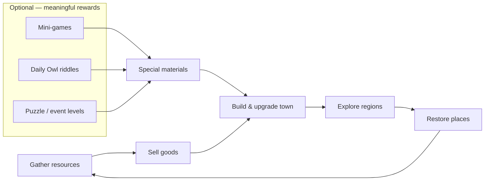
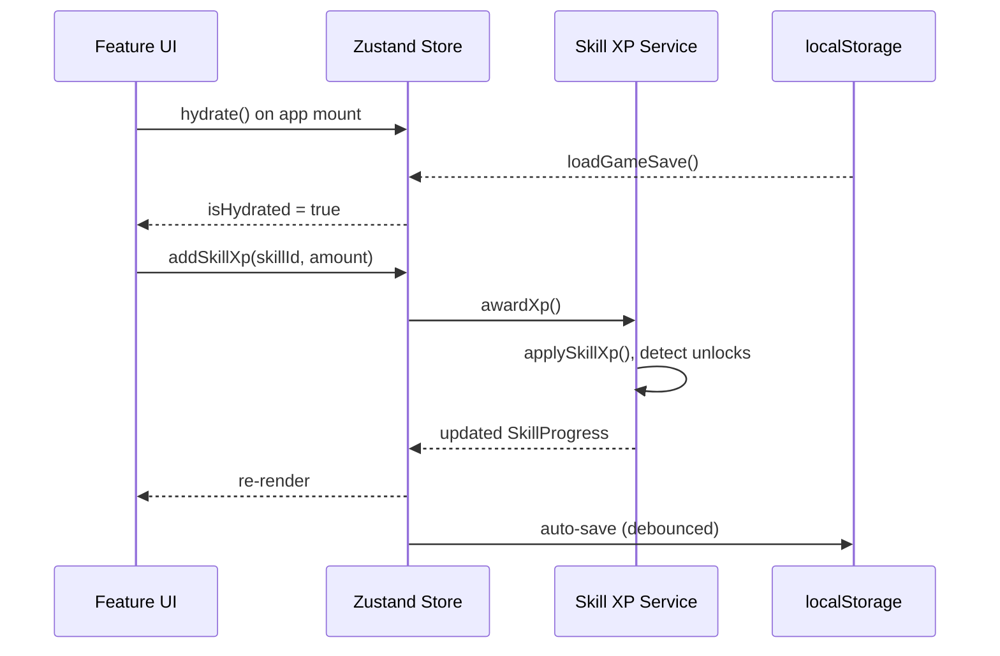
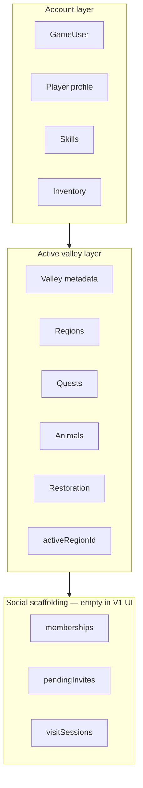

# Hearthvale Architecture

Hearthvale is a **cozy kingdom-restoration and exploration game**. The player starts with a tiny selling stand in a small village and grows into the steward of a thriving kingdom.

The core loop is **not** farming — it is:

> **Gather → Sell → Build → Explore → Restore**

Optional mini-games, daily riddles, and puzzle events feed **specialized upgrade materials** into that loop. They never replace town building, exploration, or commerce as the main game.

Product vision and phased delivery live in [VISION.md](./VISION.md) and [ROADMAP.md](./ROADMAP.md). This document describes the technical foundation designed to support years of feature growth without rewrites.

---

## Product ↔ Code Terminology

| Product language | Code / types today | Notes |
|------------------|-------------------|-------|
| Village / town | `Valley`, `ValleySaveData` | Starter settlement; first of many kingdom towns |
| Kingdom | Multi-valley account scope (future) | `valleys: Record<ValleyId, ValleySaveData>` already supports multiple settlements |
| Market stand / shop | Not yet modeled | Phase 1 → `game/commerce/` (planned) |
| Special materials | `ResourceId`, `ItemId` | Extend catalogs; mini-games award typed rewards via `GameReward` |
| Regions | `RegionId`, `regions` slice | Valley, Sanctuary, Dock, Forest today; islands add new IDs |

---

## Core Gameplay Loop



Each loop iteration should feel relaxing, surprising, and rewarding. Progression is driven by **commerce milestones**, **skills**, **regions**, **restoration projects**, **quests**, **animals**, and **relationships** — not crop timers.

### Mini-game reward philosophy

Mini-games are **optional side activities**. Each type awards a **distinct material** so players choose activities based on upgrade goals:

| Mini-game type | Material (product) | Upgrade focus |
|----------------|-------------------|---------------|
| Animal Rescue | Sanctuary materials | Sanctuary, animal shelters |
| Merchant puzzles | Trade vouchers | Shop, harbor contracts |
| Gem puzzles | Crystal shards | Landmarks, decor |
| Navigation puzzles | Boat components | Dock, boat, islands *(optional accelerator)* |
| Daily Owl riddles | Wisdom tokens | Skills, recipes |

Rewards flow through the shared `GameReward` type (`resource`, `item`, `skill_xp`, `unlock`). Catalog definitions live in `game/constants/`; a future reward service will apply them consistently across quests, restoration, events, and mini-games.

---

## Tech Stack

| Layer | Choice |
|-------|--------|
| Framework | Next.js 16 (App Router) |
| Language | TypeScript (strict, no `any`) |
| Styling | Tailwind CSS (mobile-first) |
| State | Zustand |
| Persistence | localStorage (versioned, migration-ready) |
| Future | Supabase multiplayer / cloud saves |

---

## Folder Responsibilities

```
app/                  Next.js routes, layouts, global shell
components/           Shared, presentational UI (no domain logic)
features/             Feature-vertical modules (UI + hooks per gameplay area)
game/                 Pure domain logic — no React, no Zustand
  constants/          Static IDs, definitions, catalogs
  skills/             XP curve, progression, centralized XP service
  player/             Player defaults and helpers
  valley/             Valley defaults, roles, permissions
  regions/            Region state factories
  animals/            Animal definitions
  quests/             Quest state factories
  inventory/          Inventory state factories
  restoration/        Restoration state factories
  events/             Event state factories
  resources/          Resource catalog re-exports
  minigames/          Availability, progress factories (future gameplay modules)
store/                Zustand store, persistence, migrations, slices
types/                Domain interfaces and branded ID types
```

### Planned domains (not yet in repo)

These follow the same expansion pattern when their roadmap phase ships:

| Domain | Folder (planned) | Phase |
|--------|------------------|-------|
| Commerce / selling | `game/commerce/` | Phase 1 |
| Town buildings | `game/town/` | Phase 1–2 |
| Gathering nodes | `game/gathering/` | Phase 1 |
| Daily riddles | `game/riddles/` | Phase 2 |
| Harbor / trade | `game/trade/` | Phase 3–4 (contracts, caravans — fixed payouts) |
| Boat / travel | `game/travel/` | Phase 3 |
| Kingdom economy | `game/economy/` | Phase 5 (prosperity, happiness, supply/demand, taxes) |

### Separation of Concerns

| Layer | Responsibility |
|-------|----------------|
| `types/` | **What** exists — interfaces, enums, branded IDs |
| `game/constants/` | **Catalog data** — definitions keyed by ID |
| `game/*/` | **Domain rules** — factories, calculators, services |
| `store/` | **Runtime state** — mutable player progress |
| `features/` | **Player-facing modules** — screens, panels, flows |
| `components/` | **Reusable UI** — buttons, layout, providers |

Domain logic never imports from React or Zustand. The store orchestrates; `game/` computes.

---

## State Flow



A future **reward service** will sit alongside the skill XP service — quests, restoration, mini-games, and riddles will call one entry point to grant `GameReward[]` instead of mutating inventory or resources ad hoc.

### Store Shape

The global `useGameStore` holds:

**Account layer**

- **user** — local account stub (`GameUser`)
- **player** — resources, preferences, linked to `user` via `userId`
- **skills** — `Record<SkillId, SkillProgress>` (total XP is source of truth)
- **inventory** — collected items

**Active valley layer** (mirrors `valleys[activeValleyId]` on save)

- **valley** — active valley metadata (name, owner)
- **activeValleyId** — which valley is loaded
- **activeRegionId** — current region within the active valley
- **regions** — unlock / discovery / restoration progress per region
- **quests** — quest status and objectives
- **animals** — owned animals and bond state
- **animalSpecies** — species-level progress
- **restoration** — active restoration projects
- **events** — runtime event state (festival cart scheduler)
- **minigames** — per-game progress (catalog live; playable games Phase 1–3 per roadmap)
- **decorations** — placed decor state (placement UI Phase 2)

**Social scaffolding** (persisted, no UI yet)

- **memberships** — valley roles for future shared valleys
- **pendingInvites** — async invite records
- **visitSessions** — visit windows with permission grants

Derived values (skill level, XP to next level, unlock lists) are **computed on read**, not stored.

---

## Skill Progression Philosophy

Skills are RuneScape-*inspired* but cozy — familiar exponential curves with gentle milestone rewards.

### Registered Skills

Gardening · Foraging · Animal Care · Crafting · Cooking · Fishing · Exploration · Charm · Friendship · Restoration

Skills back the kingdom fantasy: **Foraging** and **Gardening** feed goods to sell; **Animal Care** supports sanctuary and produce; **Exploration** gates harbor and islands; **Charm** and **Friendship** deepen town relationships; **Restoration** ties to place-making across the kingdom.

### Architecture Principles

1. **Total XP is persisted; level is derived** — avoids desync bugs.
2. **Definitions live in `game/constants/skills.ts`** — add a skill by registering an ID + definition; no store refactor.
3. **XP flows through one service** — `createSkillXpService()` / `addSkillXp()`. Gameplay systems must not mutate `skills` directly.
4. **Unlocks are milestone-based** — each skill defines `SkillUnlock[]` at specific levels with future `SkillPerk` slots.
5. **Max level 99** — XP caps at the curve ceiling; perks and gates hook into unlock records.

### Store API

```typescript
addSkillXp(skillId, amount)   // Award XP; returns newly unlocked milestones
getSkillLevel(skillId)        // Derived current level
getSkillUnlocks(skillId)      // All unlocks at or below current level
getSkillLevelInfo(skillId)    // Full progress snapshot for UI
```

### Adding a New Skill

1. Add ID to `SKILL_IDS` in `game/constants/skills.ts`
2. Add `SkillDefinition` with unlock milestones
3. `ALL_SKILL_IDS` auto-includes it via `Object.values(SKILL_IDS)`
4. `createInitialSkillsState()` initializes at level 1 (0 XP)
5. Award XP through `addSkillXp()` from quests, restoration, commerce, mini-games, etc.

---

## Persistence

| Concern | Implementation |
|---------|----------------|
| Storage key | `hearthvale:save` |
| Format version | `SAVE_VERSION` in `types/save.ts` |
| Auto-load | `GameProvider` → `hydrate()` on mount |
| Auto-save | `subscribeToAutoSave()` — debounced 500ms; flushes on unmount |
| Hydration gate | `useIsGameHydrated()` / `useHydratedGameStore()` — SSR-safe |
| Validation | `store/save-validation.ts` — rejects corrupt/unsupported saves |
| Restore merge | `store/merge-state.ts` — deep-merge player resources/preferences |
| Persistable keys | `store/persistable-state.ts` — single list of saved slices |
| Migrations | `store/migrations.ts` — chain `SaveMigration` records (v1 → v2 → v3 wraps flat save into valley-scoped v3) |

Save payload mirrors store slices plus `version` and `savedAt`. When bumping `SAVE_VERSION`, add a migration and merge new defaults in `fromSaveData()`.

Future Supabase sync can reuse `GameSaveData` as the wire format — swap the persistence adapter without touching domain code.

---

## Multiplayer Philosophy

Hearthvale multiplayer is **cozy, safe, and asynchronous-first**. Players should be able to invite friends, visit each other's valleys, help with small tasks, and send gifts — without requiring real-time co-presence or competitive pressure.

| Principle | What it means in practice |
|-----------|---------------------------|
| Async-first | Visits, gifts, and help arrive as gentle notifications — not live sessions |
| Permission-gated | Every action checks `ValleyPermission` derived from role + overrides |
| Valley-scoped progress | Regions, quests, animals, restoration, and decor belong to a **valley**, not a global blob |
| Local-first V1 | Single-player flow stays on device; cloud sync is an adapter swap later |
| No fake auth | `GameUser` is a local stub until real accounts ship |

### Domain Models (`types/user.ts`, `types/valley.ts`)

| Model | Purpose |
|-------|---------|
| `GameUser` | Account identity (local stub today, cloud-backed later) |
| `Player` | Gameplay profile — resources, preferences, linked via `userId` |
| `Valley` | Named container with an owner — maps to a village/town |
| `ValleyMember` | Role + optional permission overrides for shared valleys |
| `ValleyRole` | `owner` · `member` · `visitor` |
| `ValleyPermission` | `view_valley` · `collect_gifts` · `help_tasks` · `decorate` · `manage_invites` · `manage_valley` |
| `ValleyInvite` | Async invite record (pending/accepted/declined/expired/revoked) |
| `VisitSession` | A cozy visit window with explicit permission grants |

Role defaults live in `game/valley/permissions.ts`. Use `getEffectivePermissions()` and `hasValleyPermission()` — never hard-code role checks in UI.

### Valley-Scoped State

Runtime state splits into three layers:



**Player-global (follows the account):** `user`, `player`, `skills`, `inventory`

**Valley-local (per valley, denormalized at store root for the active valley):** `activeRegionId`, `regions`, `quests`, `animals`, `restoration`, `events`, `minigames`, `decorations`

**Social scaffolding (persisted, unused in V1 UI):** `memberships`, `pendingInvites`, `visitSessions`

The Valley Map reads the same flat keys as before (`activeRegionId`, `regions`, …). `store/valley-state.ts` provides selectors (`pickActiveValleyGameplay`, `selectActiveRegionId`) for future valley-switching without rewriting features.

### Save Format v3

```typescript
{
  version: 3,
  user, player, skills, inventory,     // account layer
  activeValleyId,
  valleys: { [valleyId]: ValleySaveData },  // per-valley gameplay blobs
  memberships, pendingInvites, visitSessions // social scaffolding
}
```

v2 flat saves migrate automatically: gameplay wraps into `valleys.valley_home`, `player.activeRegionId` moves to valley scope, and a local `GameUser` is seeded from the legacy player record.

### Future Supabase Tables (conceptual)

| Table | Maps to |
|-------|---------|
| `users` | `GameUser` + auth provider IDs |
| `players` | `Player` profile row per user |
| `valleys` | `Valley` metadata |
| `valley_saves` | `ValleySaveData` JSON blob or normalized columns |
| `valley_members` | `ValleyMember` |
| `valley_invites` | `ValleyInvite` |
| `visit_sessions` | `VisitSession` |

Sync strategy: push/pull **valley blobs** independently from account progress. Conflict resolution stays per-valley — not global save overwrite. Cloud sync and async visits ship with Phase 5 per [ROADMAP.md](./ROADMAP.md); social scaffolding exists from Phase 0.

### Why V1 Remains Local-First

- No auth or network dependency for the core loop
- Valley Map and persistence keep working offline
- Social records exist as typed empty scaffolding — ready for Supabase without rewiring the store
- Real-time features (live co-presence, sockets) are explicitly out of scope until async visits feel great

---

## Starter Data

### Regions

Valley (starter village) · Sanctuary · Dock · Forest

Islands and additional settlements add new `RegionId` / `ValleyId` entries per [ROADMAP.md](./ROADMAP.md).

### Animals (species catalog)

Rabbit · Duck · Fox

### Resources

Coins · Hearts · Valley Charm

Phase 1+ extends the resource catalog with gatherable goods and specialized mini-game materials (sanctuary materials, trade vouchers, crystal shards, boat components, wisdom tokens).

### Mini-games (catalog)

**Registered today:** Fishing Derby · Animal Rescue — definitions and journal UI exist; playable implementations ship Phase 1–3.

**Planned types** (reward philosophy above; constants extend per roadmap phase): Merchant puzzles · Gem puzzles · Navigation puzzles · Daily Owl riddles (via `game/riddles/`).

All skills initialize at **level 1** (0 total XP).

---

## Expansion Strategy

When building a new gameplay system:

1. **Define types** in `types/`
2. **Add constants/definitions** in `game/constants/` or `game/<domain>/`
3. **Add state factory** in `game/<domain>/state.ts`
4. **Extend store** via a slice in `store/slices/`
5. **Build UI** in `features/<name>/`
6. **Award progression** through services (`addSkillXp`, future reward service)

Avoid cross-feature imports. Features talk to the store; the store talks to domain services.

---

## Systems by Roadmap Phase

Implementation status and phase assignment — see [ROADMAP.md](./ROADMAP.md) for exit criteria.

| System | Domain touchpoints | Phase |
|--------|-------------------|-------|
| **Foundation** (map, skills, saves, quests) | `store/`, `game/skills/`, `features/valley-map/` | 0 ✓ |
| **Market stand & selling** | `game/commerce/` (planned), `inventory`, `player.resources` | 1 |
| **Resource gathering** | `game/gathering/` (planned), `regions`, skills | 1 |
| **Town buildings** | `game/town/` (planned), `decorations`, restoration | 1–2 |
| **Animal sanctuary (playable care)** | `game/animals`, `features/animal-sanctuary` | 1–2 |
| **Daily Owl riddles** | `game/riddles/` (planned), `events` | 2 |
| **Merchant / rescue mini-games** | `types/minigame.ts`, `game/constants/minigames.ts`, specialized `ResourceId`s | 2 |
| **Decor placement** | `decorations` slice, `features/` | 2 |
| **Harbor trade & boat** | Dock region, `game/trade/`, `game/travel/` (planned) | 3 |
| **Islands** | New `RegionId`s, Exploration skill, boat progression | 3 |
| **Gem / navigation puzzles** | `minigames`, boat and landmark materials; navigation optional | 3 |
| **Fishing Derby (playable)** | Dock, Fishing skill, commerce goods | 3 |
| **Puzzle campaigns** | `game/events`, chained event levels | 2–3 |
| **Second settlement** | `valleys` map, kingdom overview UI | 4 |
| **Trade routes & reputation** | `game/trade/` (caravan logistics), player titles | 4 |
| **Leaderboards** | Mini-game `highScoreByDifficulty`, cloud adapter | 4 |
| **Kingdom economy sim** | `game/economy/` (planned) — prosperity, citizen happiness, supply/demand, taxes | 5 |
| **Seasonal events** | `game/events`, limited quests & decor (Phases 2–4); price effects (Phase 5) | 2–5 |
| **Multiplayer / cloud** | Supabase adapter; valley blob sync; `GameUser` auth | 5 |

### Deferred regions & features

Train station, mine, observatory, and air balloon remain valid future regions. They are **not** on the critical path until harbor/islands and multi-settlement loops land, unless promoted in the roadmap.

---

## Quality Standards

- Strict TypeScript — branded IDs prevent cross-domain mistakes
- No `any` — use `unknown` + guards at persistence boundaries
- Pure domain functions — testable without React
- Mobile-first UI — desktop enhances, never required
- Versioned saves — never strand players on old data
- Optional mini-games — core loop completable without them; navigation puzzles accelerate boat progress but never block exploration

---

*The foundation is intentionally thin on gameplay. Every future feature should feel like plugging into a well-labeled socket — not rewiring the house.*
