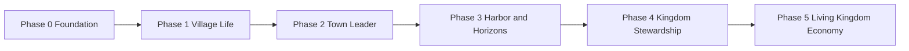

# Hearthvale — Product Roadmap

This roadmap is **phased and realistic**. Each phase builds on the last. We ship playable slices, not everything at once.

**Current baseline (already in the repo):** valley map, four regions, skill progression (10 skills), quest journal, region restoration, animal sanctuary scaffolding (species catalog, bond/happiness UI), festival-cart events, mini-game catalog (Fishing Derby + Animal Rescue definitions, journal UI — no playable games yet), inventory slice (no dedicated screen), and versioned local saves (v3, valley-scoped).

**Not in scope for this document:** implementation details — see [ARCHITECTURE.md](./ARCHITECTURE.md).

---

## Phase Dependencies

| Phase | Requires | Unlocks |
|-------|----------|---------|
| **1** | Foundation (map, saves, skills, quests) | Gather → sell → build loop; light town structures |
| **2** | Phase 1 commerce loop | General store, decor, daily riddles, rescue/merchant mini-games, puzzle campaigns |
| **3** | Phase 2 town depth + dock restoration progress | Harbor trade, boat, islands, navigation/gem puzzles |
| **4** | Phase 3 island access | Second settlement, caravan routes, kingdom map, leaderboards |
| **5** | Phase 4 multi-settlement loop | Prosperity/happiness/tax simulation, dynamic supply/demand, cloud saves |

**Scope guardrails (Phases 1–3):** No kingdom-wide taxes, citizen happiness simulation, dynamic regional pricing, or multi-settlement economy. Keep the early game cozy — one village, coins, and gentle progression.

---

## Phase 0 — Foundation *(mostly complete)*

**Goal:** A stable shell that can grow for years without rewrites.

| Deliverable | Status |
|-------------|--------|
| Next.js app shell, mobile-first UI | Done |
| Zustand store + versioned localStorage saves | Done |
| Skill XP service (10 skills, milestone unlocks) | Done |
| Valley map with region travel | Done |
| Quest journal + starter quests | Done |
| Region restoration projects | Done |
| Animal sanctuary (species catalog, basic UI) | Done |
| Festival cart / scheduled events | Done |
| Mini-game types + journal UI (catalog, no playable games) | Done |
| Valley-scoped save format (v3) + migration chain | Done |
| Social scaffolding (memberships, invites — no UI) | Done |

**Exit criteria:** Player can open the map, travel regions, progress quests, start restoration, see events, and persist progress offline.

**Remaining Phase 0 polish (small):**

- Align in-game copy and region names with village/kingdom framing where it helps clarity
- Inventory screen wired to real gathered/sold items (today: structure exists, content thin)

---

## Phase 1 — Village Life *(next major focus)*

**Goal:** Make the **main game loop** feel real — gather, sell, build, explore, restore.

**Player milestone:** *Market Stand → Village Shop*

| Feature | Description |
|---------|-------------|
| **Market stand** | Starter selling UI: list gathered goods, set prices within bands, earn coins |
| **Resource gathering** | Region-tied gathering actions (forage forest, fish dock, tend valley plots) |
| **Goods catalog** | Items with source, base value, and quality tiers |
| **Shop upgrades** | Spend coins + materials on stand → shop milestones (capacity, display, reputation) |
| **Town building (light)** | Place or unlock a small set of village structures tied to shop tier |
| **Exploration depth** | Region secrets, discovery markers, and gather nodes that refresh over time |
| **Quest integration** | Quests that require selling X goods, gathering Y items, or upgrading the shop |
| **Animal care loop** | Feed/bond actions that produce goods (eggs, wool) or sanctuary reputation |

**Mini-games in Phase 1:** still optional; at most one **playable Animal Rescue** puzzle to validate the reward-material pattern. Merchant puzzles ship in Phase 2. No leaderboard yet.

**Exit criteria:** A new player can gather goods, sell them from a stand, upgrade to a village shop, and fund a restoration step without touching a mini-game.

**Estimated scope:** medium — this is the highest-priority gameplay phase.

---

## Phase 2 — Town Leader *(core game expansion)*

**Goal:** Deepen town building and tie restoration to commerce and animals.

**Player milestone:** *Village Shop → General Store → Town Leader*

| Feature | Description |
|---------|-------------|
| **General store** | Wider inventory, buy/sell with NPC visitors, static sell hints (e.g. "villagers want bread") — not dynamic supply/demand |
| **Building roster** | Bakery, mill, animal barn, town square — each unlocks recipes or buffs |
| **Material tiers** | Common goods from gathering; rare materials from restoration and events |
| **Sanctuary expansion** | Animal Rescue puzzles become playable; award **sanctuary materials** |
| **Daily Owl riddle** | One riddle per day; **wisdom tokens** for skill or recipe unlocks |
| **Puzzle / event levels** | Short challenge maps triggered by festival cart or story beats |
| **Puzzle campaigns** | Multi-beat arcs chaining event levels across a festival or story season — optional, award event bundles |
| **Merchant puzzles** | Optional; award **trade vouchers** for shop and harbor upgrades |
| **Decor placement** | Use materials to personalize the village (extends existing `decorations` slice) |

**Exit criteria:** Town feels distinct per player; daily riddle and at least two mini-game types feed real upgrade paths.

---

## Phase 3 — Harbor & Horizons *(exploration arc)*

**Goal:** Open the world beyond the starter village.

**Player milestone:** *Town Leader → Harbor Trade → Island Exploration*

| Feature | Description |
|---------|-------------|
| **Harbor trade** | Dock as commerce hub — import/export goods, fulfill trade contracts |
| **Boat progression** | Repair and upgrade a boat using **boat components** from navigation puzzles or harbor contracts |
| **Navigation puzzles** | Optional mini-game type; accelerates boat readiness — island access also reachable via commerce and restoration |
| **Islands** | New `RegionId`s — unique gatherables, restoration projects, animals |
| **Gem puzzles** | Optional; **crystal shards** for landmarks and late restoration |
| **Cross-region quests** | Multi-step arcs spanning valley, dock, forest, and islands |
| **Fishing depth** | Fishing Derby playable; fish as trade goods |

**Exit criteria:** Player can sail to at least one island, complete a harbor contract, and bring island materials back to the village.

---

## Phase 4 — Kingdom Stewardship *(multi-settlement — pre-economy-sim)*

**Goal:** The player helps **other towns** and coordinates kingdom-wide logistics. This phase adds settlements and caravan routes — **not** the dynamic economy simulation (that is Phase 5).

**Player milestone:** *Island Exploration → Restoring Other Towns → Kingdom Stewardship*

| Feature | Description |
|---------|-------------|
| **Second settlement** | Unlock a distant town via boat; separate valley-scoped save blob *(train travel deferred)* |
| **Restore other towns** | Export goods and materials to NPC settlements; watch them recover |
| **Kingdom map** | Overview of settlements, caravan routes, and qualitative settlement health |
| **Trade routes** | Scheduled caravans between settlements; player sets priorities — fixed payouts, no dynamic pricing |
| **Reputation titles** | Earned through restoration and trade — cosmetic + light perks |
| **Seasonal events** | Kingdom-wide festivals with quests and decor — price effects wait for Phase 5 |
| **Leaderboards (optional)** | Friendly high scores on repeatable mini-games; no pay-to-win |

**Exit criteria:** Player stewards two settlements, maintains a caravan route, and sees a qualitative kingdom health overview.

**Explicitly not in Phase 4:** prosperity rating simulation, citizen happiness policies, tax choices, or supply/demand pricing.

---

## Phase 5 — Living Kingdom Economy *(long-term simulation — late game)*

**Goal:** Layer a simple but expressive economy simulation on top of Phase 4's multi-settlement foundation.

**Not starting until Phases 1–4 prove the loop.** Phase 5 **extends** Phase 4 caravan routes and settlement health with reactive simulation — it does not replace them.

Design targets:

| System | Behavior |
|--------|----------|
| **Prosperity rating** | Aggregate score from commerce, restoration, and happiness |
| **Citizen happiness** | Reacts to shortages, taxes, festivals, and animal welfare |
| **Supply and demand** | Regional prices shift based on what players sell and buy |
| **Crop/material markets** | Seasonal price curves; opportunities for arbitrage across routes |
| **Tax policies** | Player chooses low/medium/high tax; affects happiness vs. treasury |
| **Multiple settlements** | Each with local specialties; kingdom-wide bottlenecks |
| **Cloud saves** | Supabase adapter; optional async visits to friends' valleys |

**Exit criteria:** Player can explain why their kingdom is prosperous or struggling using in-game indicators — not spreadsheets.

---

## Mini-Game & Reward Matrix (cross-phase)

| Mini-game / activity | Material reward | Primary phase |
|----------------------|-----------------|---------------|
| Animal Rescue puzzles | Sanctuary materials | Phase 2 *(optional prototype in Phase 1)* |
| Merchant puzzles | Trade vouchers | Phase 2 |
| Daily Owl riddles | Wisdom tokens | Phase 2 |
| Gem puzzles | Crystal shards | Phase 3 |
| Navigation puzzles | Boat components | Phase 3 |
| Fishing Derby | Fish + coins (trade goods) | Phase 3 |
| Festival event puzzles | Event-specific bundles | Phase 2+ |
| Puzzle campaigns | Event-specific bundles across multi-beat arcs | Phase 2–3 |

All remain **optional**. Core progression must be achievable via gather → sell → build → explore → restore. Navigation puzzles accelerate boat progress but never block island access.

---

## What We Are Explicitly Not Building Yet

- Full kingdom economy simulation (Phase 5 — prosperity, taxes, dynamic supply/demand)
- Kingdom citizen happiness as a simulation system (Phase 5 — distinct from per-animal happiness in sanctuary)
- Real-time multiplayer or live co-presence
- Competitive PvP or guild warfare
- Premium currency shop
- Every mini-game type at once
- Train station, mine, observatory, air balloon (queued after harbor/islands unless promoted)
- All ten skills fully gameplay-backed (unlock incrementally per phase)

---

## Decision Log (living)

| Date | Decision |
|------|----------|
| 2025-06 | Product pivot: kingdom-restoration + exploration; town/commerce is core, mini-games are optional material sources |
| — | Technical term `valley` retained in code; product language uses village/town/kingdom |
| — | Leaderboards deferred until repeatable mini-games are fun in isolation (Phase 4) |
| 2026-06 | Doc audit: Phase 4 = multi-settlement logistics; Phase 5 = economy sim; navigation puzzles optional; merchant puzzles Phase 2 only |

---

## How to Use This Roadmap

1. **Pick the current phase** — only commit to exit criteria for that phase.
2. **Vertical slices** — ship gather+sell before ten gather types; ship one island before five.
3. **Architecture first** — add types and constants before UI; follow [ARCHITECTURE.md](./ARCHITECTURE.md) expansion strategy.
4. **Update this file** when scope shifts — keep phases honest.
