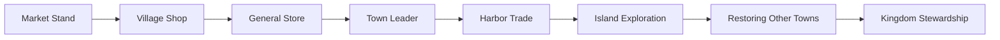

# Hearthvale — Product Vision

Hearthvale is a **cozy kingdom-restoration and exploration game**. Players begin with a tiny selling stand in a small village and grow into the steward of a thriving kingdom — restoring places, trading goods, caring for animals, and venturing beyond the harbor to help other settlements flourish.

The fantasy is gentle ambition: not empire conquest, but **earning trust through good stewardship**.

---

## Core Identity

| Pillar | What it means |
|--------|---------------|
| **Town building** | Expand and beautify the village; unlock buildings, upgrades, and civic milestones |
| **Exploration** | Travel regions, discover secrets, and eventually reach islands and distant towns |
| **Selling goods** | Gather or craft items, price them wisely, and grow from market stand to general store |
| **Resource gathering** | Forage, fish, garden, and collect materials that feed the economy and restoration |
| **Animals** | Rescue, bond, and shelter creatures; animals are companions and sources of rare goods |
| **Optional mini-games** | Short, satisfying activities that reward **special upgrade materials** — never mandatory |
| **Daily riddles** | A daily Owl riddle for wisdom tokens and a reason to return *(ships Phase 2, once the village loop is playable)* |
| **Puzzle / event levels** | Timed or story-driven challenges with meaningful rewards |
| **Puzzle campaigns** | Multi-beat festival or story arcs built from event levels — optional, material-focused |
| **Future leaderboards** | Friendly competition on optional mini-games — cozy, not cutthroat *(Phase 4+)* |
| **Future kingdom economy** | Late-game prosperity, happiness, supply/demand, and tax policies across multiple settlements |

**The town, kingdom, and exploration are the main game.** Mini-games, riddles, and puzzle events are meaningful side activities — they should feel rewarding, not like homework.

---

## Player Fantasy

Each stage unlocks new spaces, systems, and responsibilities. Early play is intimate (one stall, one village). Late play is panoramic (multiple settlements, caravan routes, kingdom stewardship). **Dynamic economy simulation** — prices, taxes, and citizen happiness reacting to player policy — is explicitly **late-game (Phase 5)**; earlier phases use a simpler shop-and-coins loop.

---

## Design Principles

### Cozy first

- No fail states that punish absence; progress should feel warm and forgiving.
- Sessions can be five minutes (sell stock, check the map) or an hour (explore, restore, play a mini-game). Once daily riddles ship (Phase 2), a quick riddle check-in becomes part of that short session.
- Visual and audio tone: soft, handcrafted, welcoming.

### Main loop over side content

- **Primary loop:** gather → sell → build → explore → restore → repeat.
- **Secondary loop:** optional mini-games, daily riddles, and event puzzles that grant specialized materials.
- Side activities must never gate core town progression — they accelerate and personalize it.

### Mini-games reward specialization

Each mini-game type should grant **different materials** used for specific upgrade paths:

| Activity | Material | Typical use |
|----------|----------|-------------|
| Animal Rescue puzzles | Sanctuary materials | Animal shelter upgrades, sanctuary restoration |
| Merchant puzzles | Trade vouchers | Shop expansions, harbor contracts |
| Gem puzzles | Crystal shards | Town landmarks, observatory, decor |
| Navigation puzzles | Boat components | Dock upgrades, island travel *(optional accelerator — never the only path)* |
| Daily Owl riddles | Wisdom tokens | Skill boosts, rare recipe unlocks |

Materials are intentionally **not fungible** — players choose which activities to favor based on what they want to build next.

### Restoration as narrative spine

Restoration projects tie regions together. Completing the sanctuary, reopening the dock, and clearing the forest path should feel like chapters in one story — not isolated checklist items.

### Economy with heart (late game — Phase 5)

The long-term kingdom simulation should make stewardship tangible:

- Prosperity rating and citizen happiness
- Supply and demand affecting crop and material prices
- Simple tax policies with visible trade-offs

**Phase boundaries:** Phases 1–3 use coins, fixed base prices, and static sell hints — cozy and approachable. Phase 4 introduces **multiple settlements, caravan logistics, and reputation titles** (player-set route priorities, qualitative settlement health) but **not** dynamic markets or tax policy. Phase 5 layers the full simulation on top of that foundation. Animal happiness (sanctuary) is separate from kingdom citizen happiness and ships much earlier.

---

## What Hearthvale Is Not

- **Not a farming sim** — crops and gardens support the economy; they are not the identity.
- **Not a competitive MMO** — multiplayer, when it arrives, is async, cozy, and visit-based.
- **Not a mini-game collection** — puzzles and riddles support the kingdom; they do not replace it.
- **Not a live-service grind** — daily content should delight, not pressure.

---

## Success Criteria

Players should be able to say:

1. *"I started with a rickety stand and now my village feels alive."*
2. *"I explored somewhere new today and brought something back that matters."*
3. *"I played a puzzle when I felt like it and got materials I actually needed."*
4. *"I want to check in tomorrow — maybe sell my foraged goods or solve the Owl's riddle."* *(riddle applies once Phase 2 ships)*

If those sentences feel true, Hearthvale is on track.

---

## Relationship to the Codebase

Today the project uses **valley** as the technical term for a player-owned settlement (`Valley`, `activeValleyId`, valley-scoped saves). In product language, the starter valley is the **first village** in a kingdom the player will eventually steward. Terminology in docs may say *town*, *village*, or *kingdom*; the architecture doc maps these to existing types.

See [ROADMAP.md](./ROADMAP.md) for phased delivery and [ARCHITECTURE.md](./ARCHITECTURE.md) for how systems plug together.
